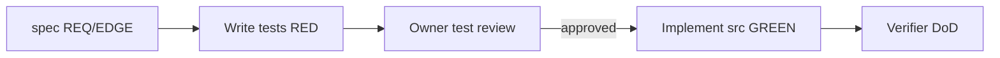

# Plan: Core interpreter — read, reduce, базовые операторы

**Spec:** [spec.md](./spec.md)  
**Дата:** 2026-06-30  
**Статус:** approved

## Constitution check

- [x] Zero runtime dependencies
- [x] Pure function, sync evaluation
- [x] Unit test coverage для всех REQ/EDGE из spec
- [x] Test-first workflow (тесты → ревью → реализация)
- [x] Новые runtime deps → ADR (не планируются)

## Test-first workflow



### Правила

| Этап | Что делаем | `npm test` |
|------|------------|------------|
| **1. Контракт** | `src/types.ts`, fixtures | — |
| **2. Тесты** | `tests/*.test.ts` по таблице покрытия в spec | **RED** (ожидаемо) |
| **3. Ревью** | Владелец читает тесты + spec, без реализации | RED |
| **4. Реализация** | `src/path.ts`, `src/nodes/*`, `src/eval.ts`, `src/index.ts` | → **GREEN** |

**До ревью тестов (T006):** в `src/` только types и заглушки `throw new Error('Not implemented')` — не считается реализацией.

**После ревью:** агент/разработчик снимает заглушки слой за слоем, не меняя утверждения в тестах без обновления spec.

## Technical approach

Слои снизу вверх (реализация **после** фазы тестов):

1. **Types** — AST types в `src/types.ts`
2. **Path** — `resolvePath(context, path)` в `src/path.ts`
3. **Nodes** — `evalRead`, `evalSum`, `evalMul`, `evalReduce` в `src/nodes/`
4. **Dispatch** — `evalNode(node, context)` в `src/eval.ts`
5. **Orchestrator** — `dslInterpreter` в `src/index.ts`

### Поток reduce

```
accumulator = 0
for item in collection:
  context = { accumulator, item }
  accumulator = evalNode(aggregator, context)
return accumulator
```

## File changes

### Phase: tests (до реализации)

| Path | Purpose |
|------|---------|
| `tests/fixtures/cart-equipment.json` | TC-001 |
| `tests/path.test.ts` | EDGE-002 |
| `tests/nodes.test.ts` | REQ-001, REQ-002, EDGE-001, EDGE-003 (unit) |
| `tests/dslInterpreter.test.ts` | TC-001, REQ-003, EDGE-001, EDGE-003 (integration) |

### Phase: implementation (после ревью тестов)

| Path | Purpose |
|------|---------|
| `src/path.ts` | `resolvePath` |
| `src/nodes/read.ts` | `evalRead` |
| `src/nodes/ops.ts` | `evalSum`, `evalMul` |
| `src/nodes/reduce.ts` | `evalReduce` |
| `src/eval.ts` | `evalNode` dispatch |
| `src/index.ts` | `dslInterpreter` |

## Data model

См. [data-model.md](./data-model.md)

## ADR triggers

| Решение | ADR needed? |
|---------|-------------|
| Error model, eval order, zero-deps | Done → [ADR-0001](../../docs/adr/0001-error-model-and-zero-deps.md) |
| Новый runtime dependency | Yes — forbidden by default |

## Validation commands

```bash
# Фаза тестов (RED ожидаем)
npm run typecheck
npm test

# Фаза реализации (цель GREEN)
npm run typecheck && npm test
```

## Risks

| Risk | Mitigation |
|------|------------|
| Тесты проверяют детали реализации, а не контракт | integration-тесты через `dslInterpreter`; unit — только публичные eval-функции из plan |
| Ревью пропущен | явный gate T006 в tasks.md |
